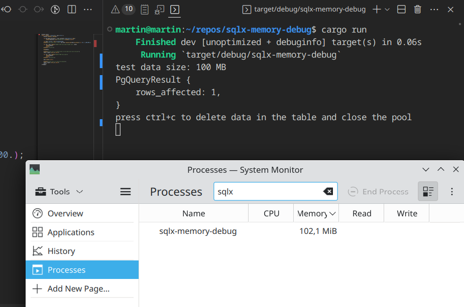

# sqlx-memory-debug

A test app to demonstrate a memory leak / surprising unlimited caching.

1. `Postgres` 13.5 or newer
2. Update `.env`
3. Create the table `test_table` with one column with the type `bytea`
4. `cargo run (-r)`
5. Open a system process monitor and notice memory usage of the process `sqlx-memory-debug`
6. Press `ctrl+c` to close the pool
7. Notice memory usage again
8. Press `ctrl+c` again to stop the program

